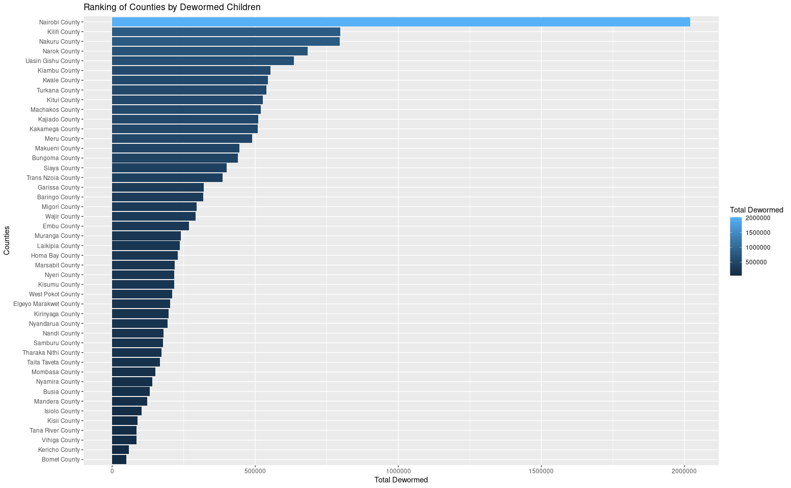
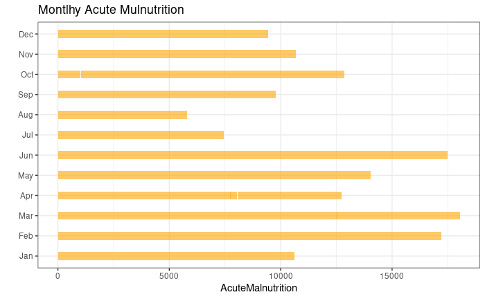
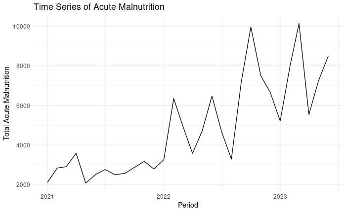
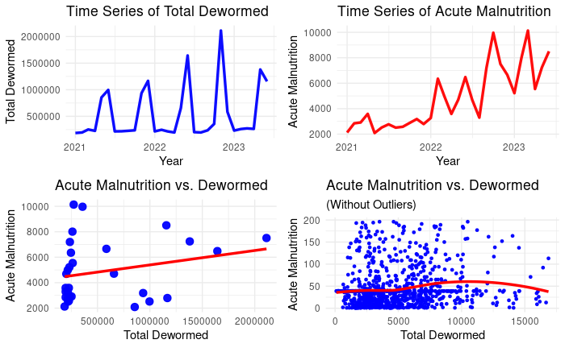
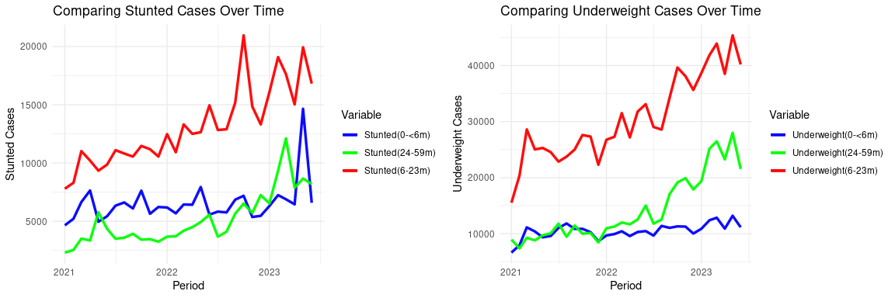
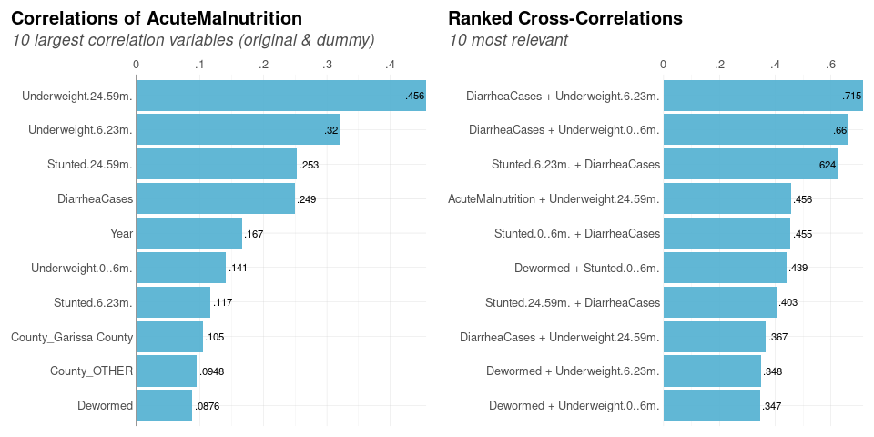

# Exploring Health Indicators for Children Under 5 in Kenya

> 📊 *A Data Analysis Project by Paul Muriithi*  
> 🗓️ *Date: July 20, 2023*

---

---
## 📚 Table of Contents

- [Project Overview](#-project-overview)
- [1. Exploratory Data Analysis EDA](#-1-exploratory-data-analysis-eda)
  - [Data Cleaning](#-data-cleaning)
  - [Summary Statistics](#-summary-statistics)
  - [Deworming by County (Top Counties)](#-deworming-by-county-top-counties)
  - [Monthly Acute Malnutrition Distribution](#-monthly-acute-malnutrition-distribution)
  - [Acute Malnutrition Over Time](#-acute-malnutrition-over-time)
- [2. Deep Dive: Relationships & Comparisons](#-2-deep-dive-relationships--comparisons)
  - [Research Question](#-research-question)
  - [Deworming vs. Malnutrition](#-deworming-vs-malnutrition)
  - [Stunted vs Underweight by County](#-stunted-vs-underweight-by-county)
  - [Time Series: Stunted & Underweight Trends](#-time-series-stunted--underweight-trends)
  - [Correlation Analysis](#-correlation-analysis)
- [3. Regression Analysis](#-3-regression-analysis)
- [Tools & Technologies](#-tools--technologies)
- [👨Author](#-author)


---


## 🌍 Project Overview

This project explores the health landscape of children under 5 years across Kenyan counties using monthly data from **January 2021 to June 2023**. The dataset features critical health indicators such as:

- 👶 Children Dewormed  
- ⚠️ Acute Malnutrition  
- 📉 Stunted Growth  
- 💩 Diarrhea Cases  
- ⚖️ Underweight Children

By identifying **trends**, **correlations**, and **regional disparities**, this study aims to guide public health interventions and improve child health outcomes.

---

## 🧪 1. Exploratory Data Analysis (EDA)

### 🧼 Data Cleaning

- Renamed variables for clarity  
- Imputed missing values using median  
- Converted time periods to proper date format  
- Extracted month and year for better grouping

---

### 📊 Summary Statistics

A breakdown of key variables from 1,410 county-level monthly records:

| Indicator               | Mean     | Std Dev   | Median   | Min  | Max    | SE     |
|-------------------------|----------|-----------|----------|------|--------|--------|
| Dewormed                | 11,457.9 | 25,372.4  | 4,564.5  | 97   | 392,800| 675.7  |
| Acute Malnutrition      | 103.6    | 233.5     | 39.0     | 1    | 4,123  | 6.2    |
| Stunted (6–23m)         | 279.2    | 379.2     | 159.0    | 1    | 4,398  | 10.1   |
| Stunted (0–<6m)         | 139.0    | 278.4     | 84.0     | 1    | 7,900  | 7.4    |
| Stunted (24–59m)        | 110.2    | 192.5     | 50.0     | 1    | 3,169  | 5.1    |
| Diarrhea Cases          | 2,813.4  | 2,161.9   | 2,158.0  | 198  | 15,795 | 57.6   |
| Underweight (0–<6m)     | 223.5    | 228.5     | 162.5    | 6    | 1,937  | 6.1    |
| Underweight (6–23m)     | 652.3    | 669.6     | 456.0    | 16   | 5,348  | 17.8   |
| Underweight (24–59m)    | 305.7    | 538.5     | 120.5    | 1    | 4,680  | 14.3   |

---

### 📍 Deworming by County (Top Counties)

> This chart highlights counties with the highest median number of dewormed children.



| County               | Total Dewormed | Acute Malnutrition |
|----------------------|----------------|---------------------|
| Nairobi              | 22,066.0       | 313.0               |
| Turkana              | 11,144.5       | 291.5               |
| Nakuru               | 10,386.5       | 161.0               |
| Kakamega             | 10,088.5       | 26.0                |
| Garissa              | 8,160.0        | 227.0               |
| Kiambu               | 7,924.0        | 92.5                |
| Bungoma              | 7,738.5        | 39.0                |
| Kilifi               | 7,539.0        | 33.0                |
| Kwale                | 7,508.5        | 83.0                |
| Uasin Gishu          | 7,392.0        | 39.0                |

---

### 📅 Monthly Acute Malnutrition Distribution

This chart shows which months saw the highest burden of acute malnutrition:



---

### 🕰️ Acute Malnutrition Over Time

A time series chart revealing trends in acute malnutrition across the reporting period:



---

## 🔎 2. Deep Dive: Relationships & Comparisons

### ❓ Research Question

> **How does acute malnutrition vary across Kenyan counties and what are its key associations with deworming, stunting, underweight, and diarrhea cases?**

---

### 🔄 Deworming vs. Malnutrition

> Visualizing the relationship between deworming efforts and acute malnutrition:



---

### 📉 Stunted vs Underweight by County

| County           | Total Stunted | Total Underweight |
|------------------|---------------|-------------------|
| Turkana          | 47,667        | 156,954           |
| Nairobi          | 106,321       | 156,930           |
| Kilifi           | 55,695        | 82,130            |
| Nakuru           | 26,994        | 67,272            |
| Marsabit         | 20,334        | 65,555            |
| Kiambu           | 30,303        | 65,325            |
| Garissa          | 8,954         | 62,778            |
| Wajir            | 9,255         | 55,566            |
| Kwale            | 30,222        | 53,607            |
| Kitui            | 32,309        | 52,957            |

---

### 🕒 Time Series: Stunted & Underweight Trends

> Visual comparison of stunted vs. underweight cases by age group over time.



---

### 📈 Correlation Analysis

> Identifying the top correlated variables with acute malnutrition:



---

## 📉 3. Regression Analysis

> A linear regression model helps quantify the influence of each variable on acute malnutrition:

| Variable                | Estimate   | Std. Error | t-value   | p-value   |
|-------------------------|------------|-------------|-----------|-----------|
| (Intercept)             | 2.8901     | 0.0562      | 51.41     | <0.0001   |
| Dewormed                | -0.0000001 | 0.0000015   | -0.05     | 0.9603    |
| Diarrhea Cases          | 0.0001283  | 0.0000234   | 5.49      | <0.0001   |
| Stunted (6–23m)         | -0.0009606 | 0.0001655   | -5.81     | <0.0001   |
| Stunted (0–<6m)         | -0.0001249 | 0.0001655   | -0.75     | 0.4506    |
| Stunted (24–59m)        | -0.0005384 | 0.0002769   | -1.94     | 0.0520    |
| Underweight (0–<6m)     | 0.0005245  | 0.0002806   | 1.87      | 0.0618    |
| Underweight (6–23m)     | 0.0006160  | 0.0001359   | 4.53      | <0.0001   |
| Underweight (24–59m)    | 0.0007892  | 0.0001086   | 7.27      | <0.0001   |

> 💡 **Key Insight:** Diarrhea and underweight variables showed significant positive relationships with acute malnutrition. Surprisingly, deworming had a near-zero direct effect in the model.

---

## 🧰 Tools & Technologies

- **R + RMarkdown**
- 📦 Libraries: `tidyverse`, `ggplot2`, `lares`, `psych`, `gridExtra`, `lubridate`, `forcats`, `viridis`, `kableExtra`
- 📁 Data Source: health_data.csv (January 2021 – June 2023)

---

## 👨🏽‍💻 Author

**Paul Muriithi**  
🎓 Data Analyst | 📍 Nairobi, Kenya  
📬 [Email Me](mailto:paulmuriithi@example.com)  
🌐 [GitHub](https://github.com/yourprofile) | [LinkedIn](https://linkedin.com/in/yourprofile)

---

## 📁 Project Structure

```bash
📂 health-indicators-under5/
├── health_data.csv
├── analysis_script.Rmd
├── README.md
└── assets/
    ├── Dewormed_by_county.png
    ├── monthly_Acute_malnutrition.png
    ├── Acute_Mulnutrition.png
    ├── TotalDewormed_vs.Acute_Malnutrition.png
    ├── Stunted_and_Underweight.png
    └── Correlation_Analysis.png
